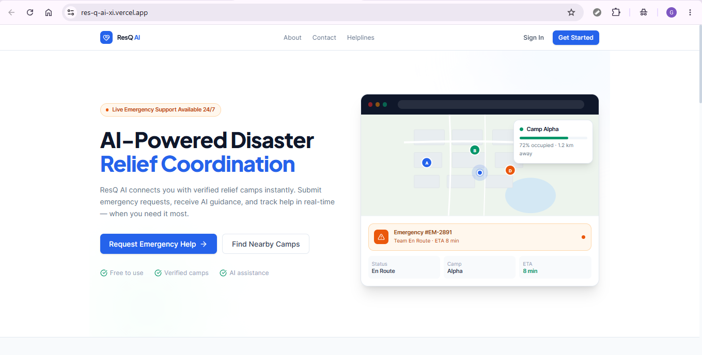
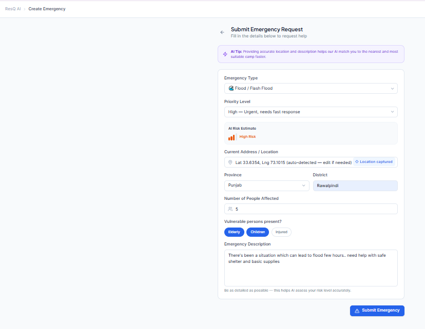
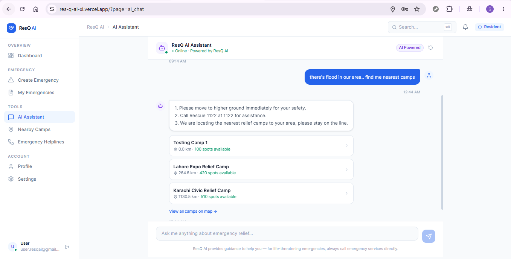
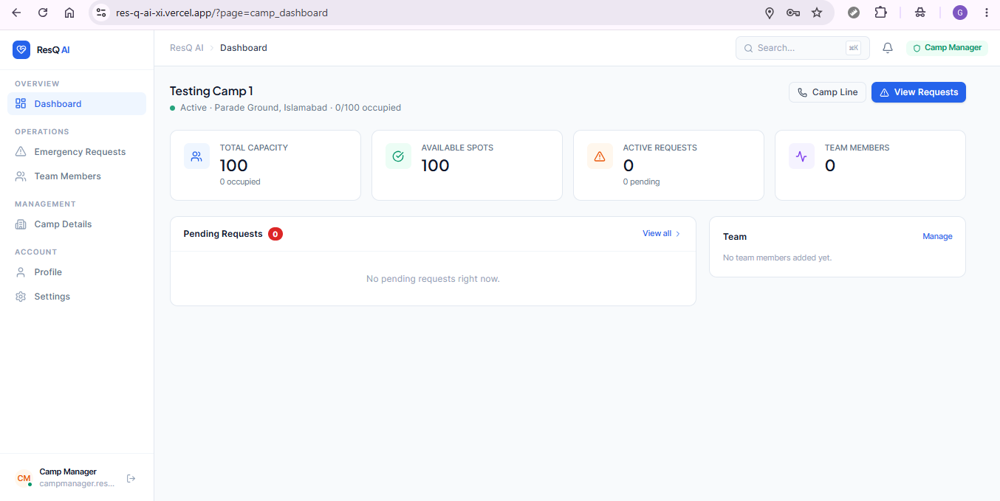
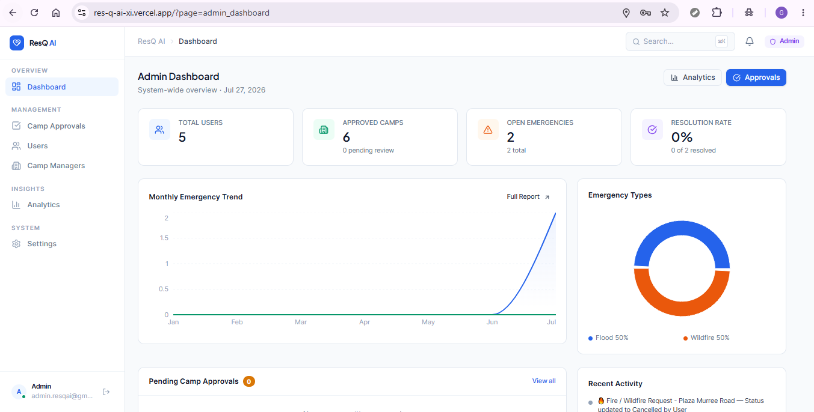

# ResQ AI

**AI-assisted disaster relief coordination for Pakistan.**

🔗 **Live app:** [https://res-q-ai-xi.vercel.app/](https://res-q-ai-xi.vercel.app/)

---

## Table of Contents

- [What is ResQ AI](#what-is-resq-ai)
- [The problem it solves](#the-problem-it-solves)
- [Who it's for](#who-its-for)
- [Features](#features)
- [The AI Assistant](#the-ai-assistant)
- [Tech stack](#tech-stack)
- [Screenshots](#screenshots)
- [Running the project locally](#running-the-project-locally)
- [Demo accounts](#demo-accounts)
- [Project structure](#project-structure)

---

## What is ResQ AI

ResQ AI is a full-stack disaster relief coordination platform built for Pakistan. It connects three groups in real time on a single system: **residents** who need help during a disaster (flood, earthquake, wildfire, landslide, storm, medical emergency), **relief camp managers and their teams** who provide it, and **administrators** who oversee the whole network.

A resident in danger can submit an emergency in seconds, get instant AI-powered guidance and risk assessment, and get automatically matched to the nearest relief camp with available capacity. That camp's team sees the request appear on their dashboard in real time, can accept it, dispatch help, and track it through to resolution — all with live status updates flowing back to the resident.

## The problem it solves

During disasters in Pakistan, the biggest failure point usually isn't a lack of relief camps or willing responders — it's **coordination**. People in danger don't know which camp is closest or has capacity; camps don't know who needs help or where; and there's no shared, real-time picture of who's doing what. Helplines get overloaded, information is scattered across phone calls and word of mouth, and response gets delayed exactly when speed matters most.

ResQ AI replaces that chaos with one coordinated system: a live map of camps and their real capacity, automatic camp-matching by distance and disaster type, an AI assistant that gives immediate safety guidance while help is on the way, and a verified, admin-approved network of relief camps instead of unverified claims.

## Who it's for

| Role | Who they are | What they do on the platform |
|---|---|---|
| **Resident / User** | Anyone affected by or at risk from a disaster | Submit emergencies, get AI guidance, find nearby camps, track their request status, access verified helplines |
| **Camp Manager** | Runs a relief camp | Registers their camp (admin-approved), manages capacity/supplies, builds their response team, accepts and resolves emergency requests |
| **Camp Helper (Team Member)** | Added by a Camp Manager | Responds to assigned emergencies, updates camp status, works under the camp's account |
| **Admin** | Platform operator | Approves/rejects camp registrations, manages all users and camps, views platform-wide analytics |

---

## Features

### For Residents
- **Single-page emergency submission** — disaster type, description, people affected, and location in one flow (no multi-step wizard).
- **One-tap location detection** — browser geolocation auto-fills the address field with real coordinates.
- **Automatic camp matching** — on submission, the nearest suitable relief camp (by distance + capacity + disaster type) is matched and assigned immediately, so the camp's team sees it right away.
- **AI Assistant chat** — conversational guidance, powered by Groq, with real relief-camp recommendations when it detects an actual active emergency.
- **AI risk assessment** — automatic urgency/risk classification and suggested safety actions for every submitted emergency.
- **Live emergency tracking** — status timeline (Submitted → Assigned → Accepted → En Route → Arrived → Resolved) that updates in real time via Supabase Realtime.
- **Nearby camps map** — browse approved relief camps with live capacity, distance, and contact info.
- **Verified emergency helplines** — Rescue 1122, NDMA, Edhi/Aman Ambulance, Police, Fire, Women's & Child helplines, grouped by category.
- **Profile & settings management.**

### For Camp Managers
- **Camp onboarding & registration** — register a relief camp with location, capacity, and supplies; goes through admin approval before it can accept emergencies.
- **Team management** — add/remove Camp Helpers by email; their account role is promoted automatically.
- **Emergency request queue** — see all emergencies assigned to your camp in real time, accept them, update status, and resolve them.
- **Camp dashboard** — live occupancy, capacity, and request stats.

### For Camp Helpers
- Everything the camp's emergency queue needs, scoped to the camp they were added to — respond to and update assigned emergencies.

### For Admins
- **Pending approvals queue** — approve or reject newly registered relief camps.
- **User & camp management** — full visibility and control across every account and camp on the platform.
- **Platform analytics** — real usage statistics and charts (emergencies by status/type, camp capacity, response metrics) driven entirely by live Supabase data.

### Platform-wide
- **Role-based access control** enforced both in the UI and via Supabase Row Level Security.
- **Real-time everywhere** — emergencies, notifications, camp status, and team changes all sync live without a page refresh (Supabase Realtime channels).
- **In-app notifications** with read/unread state.
- **Public pages** — About, Contact, Privacy Policy, and a public Emergency Helplines directory, accessible without an account.
- **Session-scoped AI chat history** — your AI Assistant conversation persists while you're logged in and is automatically cleared on logout/login, so nothing leaks between accounts on a shared browser.

---

## The AI Assistant

ResQ AI uses **Groq** (`llama-3.3-70b-versatile`) for two distinct AI features, both returning strict structured JSON so the app can act on the output, not just display it.

### 1. AI Chat Assistant (`/api/ai/chat`)

A conversational assistant embedded in the app. It classifies every message and decides — deliberately conservatively — whether the user is describing a **real, active, located emergency** (in which case it surfaces real nearby relief camps from the database) versus asking a general question or hypothetical ("what should I do *if*...") — in which case it just answers, with no camp data attached.

**System prompt:**

```
You are the ResQ AI Assistant, an emergency-guidance assistant embedded in a disaster relief coordination platform for Pakistan.

Tone:
- Always calm, empathetic, and reassuring — acknowledge the person's fear or stress in a brief, human way before giving instructions.
- Keep it easy to understand: plain language, no jargon, no filler.

Your job:
- Understand disaster/emergency situations and questions described by the user.
- Detect the disaster type from this exact list: flood, earthquake, wildfire, landslide, storm, medical, other (use "other" if unclear, null if not applicable).
- Detect urgency as one of: LOW, MEDIUM, HIGH, CRITICAL (null if not applicable).
- Detect the language the user is writing in (e.g. "en", "ur") and reply in that same language. If they mix Urdu and English, reply naturally in the same mixed style.
- Extract any specific location the user mentions in THIS message (a named city/district/area, "near my house", "my street", "our village", etc.), or null if the message names no location at all.
- Decide is_emergency — be strict, this controls whether the user gets shown real relief camps, so false positives are worse than false negatives:
  - true ONLY if BOTH: (1) the user is reporting something happening to them or nearby RIGHT NOW, not a hypothetical, AND (2) they named a specific location for it in this message.
  - false for: general/preparedness questions ("what should I do if...", "how do I prepare for...", "what if a fire happens"), advice-seeking with hypothetical framing (the word "if" describing a possibility, not a fact), questions with no location mentioned, or anything not a live first-hand report.
  - Examples of false: "What should I do if there's a fire near my house?" (hypothetical "if"), "How do I evacuate safely?" (general tips), "What's the risk level in my area?" (no named location).
  - Examples of true: "There's a fire near my house right now, what do I do?", "My street in Model Town, Lahore is flooding.", "We're trapped in Swat after the landslide."
- Format every reply as either:
  - Numbered steps for sequential actions the person should take, one action per line, using real newline characters between them.
  - Bullet points for non-sequential lists (things to pack, symptoms to watch for, general dos/don'ts), each on its own line.
  - A short 1-2 sentence paragraph only when the answer is a single direct fact with nothing to list.
- When relevant, mention Pakistan emergency helplines. Always include Rescue 1122 for CRITICAL or HIGH urgency active emergencies.
- If the user's message is NOT related to disasters, emergencies, safety, relief camps, or this platform, politely refuse and steer them back to disaster-related topics. Set topic_allowed to false in that case, and keep "reply" a short, polite redirection — do not answer the unrelated question.

You must respond with ONLY a single JSON object, no markdown, matching exactly this shape:
{
  "topic_allowed": boolean,
  "is_emergency": boolean,
  "reply": string,
  "disaster_type": string | null,
  "urgency": "LOW" | "MEDIUM" | "HIGH" | "CRITICAL" | null,
  "language": string,
  "extracted_location": string | null
}
```

The frontend only triggers a camp lookup (Haversine-distance-ranked, real Supabase data) when `topic_allowed`, `is_emergency`, and `extracted_location` are all true/present — so a general safety question never gets camp cards attached to it, only a genuine reported emergency does.

### 2. Emergency Risk Assessment (`/api/ai/assess-emergency`)

Runs automatically whenever a resident submits an emergency, in parallel with camp matching. It classifies disaster type, urgency, and risk level, and generates concrete, immediately actionable safety steps for that specific situation — stored alongside the emergency record.

**System prompt:**

```
You are an emergency triage assistant for ResQ AI, a disaster relief platform in Pakistan. Given a description of an emergency, assess it and respond with ONLY a single JSON object, no markdown, matching exactly this shape:
{
  "disaster_type": one of [flood, earthquake, wildfire, landslide, storm, medical, other],
  "urgency": "LOW" | "MEDIUM" | "HIGH" | "CRITICAL",
  "risk_level": "low" | "medium" | "high",
  "summary": a one-sentence neutral summary of the situation,
  "suggested_actions": an array of 3-5 short, concrete, immediately actionable safety steps for the people affected while help is on the way
}
Base urgency on threat to life, number of people affected, and time sensitivity. If the description is not actually describing an emergency, still return your best-effort classification with urgency "LOW".
```

Both routes call the Groq API directly server-side (`GROQ_API_KEY`, never exposed to the client), use `response_format: { type: "json_object" }` for reliable structured output, and fail safely with a clear error rather than a broken UI if the AI service is unreachable.

---

## Tech stack

**Framework & language**
- [Next.js 15](https://nextjs.org/) (App Router) + React 19 + TypeScript

**Backend & data**
- [Supabase](https://supabase.com/) — Postgres database, Auth, Realtime subscriptions, and Row Level Security
- `@supabase/ssr` for browser/server/admin Supabase clients

**AI**
- [Groq](https://groq.com/) (`groq-sdk`) running `llama-3.3-70b-versatile` for the chat assistant and emergency risk assessment

**Data & forms**
- [TanStack Query](https://tanstack.com/query) for server-state fetching/caching
- `react-hook-form` + `zod` + `@hookform/resolvers` for validated forms
- `recharts` for admin analytics charts
- `date-fns` for date handling

**Styling & UI**
- Tailwind CSS v4 (via the Vite/Next plugin, no PostCSS config needed)
- `lucide-react` icons, `class-variance-authority` + `tailwind-merge` for component variants

**Infra & tooling**
- Deployed on [Vercel](https://vercel.com/)
- [`@vercel/analytics`](https://vercel.com/docs/analytics) for page view/visitor tracking
- `resend` / SMTP for transactional email
- Browser Geolocation API for "detect my location"
- ESLint + TypeScript strict checks; Playwright available for e2e testing

---

## Screenshots

**Landing page** — the public entry point residents and camp managers land on.


**Report Emergency** — the single-page emergency submission form.


**AI Assistant** — conversational guidance, with real relief camps surfaced only for genuine located emergencies.


**Camp Manager dashboard** — live emergency requests assigned to the camp.


**Admin Analytics** — platform-wide usage statistics driven by live Supabase data.


---

## Running the project locally

### Prerequisites
- Node.js 20+
- [pnpm](https://pnpm.io/) — this repo is pnpm-managed (`pnpm-lock.yaml`)
- A Supabase project (free tier is fine)
- A [Groq API key](https://console.groq.com/)

### 1. Clone & install

```bash
git clone <this-repo-url>
cd "ResQ AI"
pnpm install
```

### 2. Configure environment variables

Copy `.env.example` to `.env.local` and fill in the values:

```bash
cp .env.example .env.local
```

Required:

| Variable | Purpose |
|---|---|
| `NEXT_PUBLIC_SUPABASE_URL` | Supabase project URL |
| `NEXT_PUBLIC_SUPABASE_ANON_KEY` | Supabase public anon key |
| `SUPABASE_SERVICE_ROLE_KEY` | Supabase service role key (server-only) |
| `DATABASE_URL` | Supabase Postgres connection string |
| `GROQ_API_KEY` | Groq API key for both AI routes |

Optional (email, maps):

| Variable | Purpose |
|---|---|
| `EMAIL_FROM`, `RESEND_API_KEY` or `SMTP_*` | Transactional email |
| `NEXT_PUBLIC_MAP_PROVIDER`, `NEXT_PUBLIC_MAPTILER_KEY`, `NEXT_PUBLIC_GOOGLE_MAPS_API_KEY` | Map rendering |

### 3. Set up the database

```bash
pnpm db:migrate
```

This applies every SQL file in `supabase/migrations/` (schema, enums, RLS policies, and seeded Pakistan reference data) against `DATABASE_URL`.

### 4. Run the dev server

```bash
pnpm dev
```

The app runs at `http://localhost:3000` (Next.js dev server with hot reload).

### Other useful scripts

```bash
pnpm build              # production build
pnpm start              # run the production build
pnpm lint                # ESLint
pnpm db:seed:demo-users  # seed demo accounts (see below)
```

---

## Demo accounts

For quickly exploring every role without registering:

| Role | Email | Password |
|---|---|---|
| Admin | `admin.resqai@gmail.com` | `ResQ@123` |
| Camp Manager | `campmanager.resqai@gmail.com` | `ResQ@123` |
| Camp Helper | `helper.resqai@gmail.com` | `ResQ@123` |
| Resident / User | `user.resqai@gmail.com` | `ResQ@123` |

Seed these locally with `pnpm db:seed:demo-users` after migrations are applied.

---

## Project structure

```
src/
  app/                 Next.js App Router: layout, API routes (/api/ai, /api/health, ...)
  App.tsx              Client-side app shell: routing, role gating, layout
  components/          Shared UI (Layout, PublicPageShell, ui/ primitives)
  screens/             Page-level screens, grouped by role (user/, camp/, admin/)
  lib/
    ai/                Groq client
    services/          Supabase-backed data services (emergencies, camps, notifications, ...)
    supabase/          Browser/server/admin Supabase client factories
    auth/               Role helpers
    constants/          Pakistan reference data, helplines, storage keys
  hooks/               Realtime + geolocation hooks
  providers/           Auth + React Query providers
  types/               Shared domain & auth types
supabase/migrations/   Database schema, RLS policies, seed data
docs/                  Architecture, Supabase setup, and deployment notes
```
